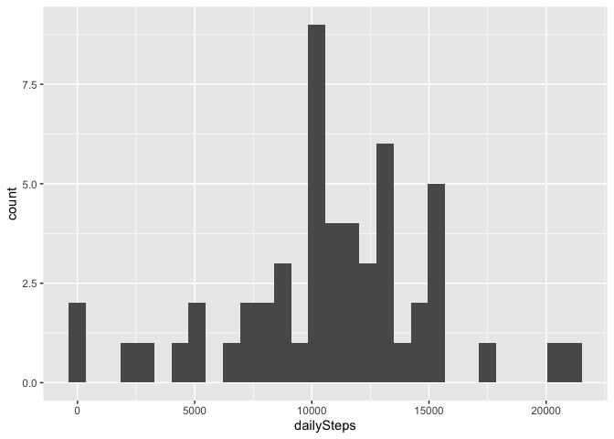
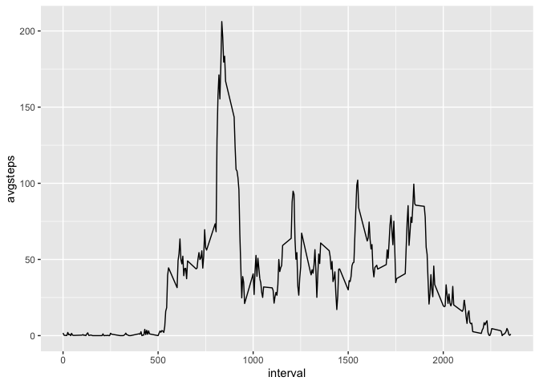
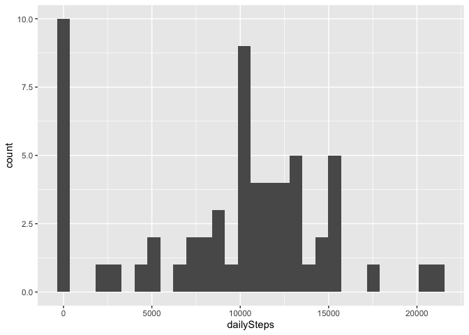
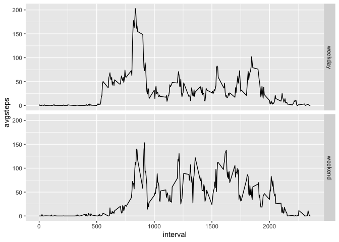

```r
library(dplyr)
library(ggplot2)
library(knitr)
Sys.setlocale("LC_TIME","English") #necessary for non English environments
```


## Loading and preprocessing the data

```r
unzip("activity.zip")
activity <- read.csv("activity.csv")
activityNoNA <- na.omit(activity)
```


## What is mean total number of steps taken per day?

```r
byDay <- activityNoNA %>% group_by(date) %>% summarise(dailySteps = sum(steps))
p <- ggplot(byDay, aes(x=dailySteps)) + geom_histogram(bins=30)
print(p)
```

<!-- -->

### Median and Mean steps

```r
asFrame = data.frame(mean=mean(byDay$dailySteps), median=median(byDay$dailySteps))
kable(asFrame, format="html", table.attr="style='width:30%;'") %>% kableExtra::kable_styling(position = "left")
```

<table style="width:30%; " class="table">
 <thead>
  <tr>
   <th style="text-align:right;"> mean </th>
   <th style="text-align:right;"> median </th>
  </tr>
 </thead>
<tbody>
  <tr>
   <td style="text-align:right;"> 10766.19 </td>
   <td style="text-align:right;"> 10765 </td>
  </tr>
</tbody>
</table>

## What is the average daily activity pattern?

```r
intervalAverage <- activityNoNA %>% group_by(interval) %>% summarise(avgsteps = mean(steps))
p <- ggplot(intervalAverage, aes(y=avgsteps, x=interval, group = 1)) + geom_line()
print(p)
```

<!-- -->

```r
orderedBySteps <- arrange(intervalAverage, desc(avgsteps))
maxStepsInterval <- orderedBySteps[1,]$interval
```

Interval 835 has the maximum number of steps per day.

## Imputing missing values

```r
missing <- dim(activity)[1] - dim(activityNoNA)[1]
```
Total number of rows with NAs: 2304

Imputing the missing values with the minimum for the same interval across all days.


```r
by <- join_by(interval)
intervalMin <- activityNoNA %>% group_by(interval) %>% summarise(minsteps = min(steps))
imputedActivity <- inner_join(activity, intervalMin, by)
imputedActivity <- imputedActivity %>% mutate(steps = coalesce(steps,minsteps))

byDayImputed <- imputedActivity %>% group_by(date) %>% summarise(dailySteps = sum(steps))
p <- ggplot(byDayImputed, aes(x=dailySteps)) + geom_histogram(bins=30)
print(p)
```

<!-- -->

### Median and Mean steps

```r
asFrame = data.frame(data="with NAs", mean=mean(byDay$dailySteps), median=median(byDay$dailySteps))
asFrame[nrow(asFrame) + 1,] <- list("imputed", mean(byDayImputed$dailySteps), median(byDayImputed$dailySteps))
kable(asFrame, format="html", table.attr="style='width:30%;'") %>% kableExtra::kable_styling(position = "left")
```

<table style="width:30%; " class="table">
 <thead>
  <tr>
   <th style="text-align:left;"> data </th>
   <th style="text-align:right;"> mean </th>
   <th style="text-align:right;"> median </th>
  </tr>
 </thead>
<tbody>
  <tr>
   <td style="text-align:left;"> with NAs </td>
   <td style="text-align:right;"> 10766.19 </td>
   <td style="text-align:right;"> 10765 </td>
  </tr>
  <tr>
   <td style="text-align:left;"> imputed </td>
   <td style="text-align:right;"> 9354.23 </td>
   <td style="text-align:right;"> 10395 </td>
  </tr>
</tbody>
</table>

There is a difference shown in the histogram, but mean and median are mostly identical.
NA values most likely mean the smartphone was turned off and the subject was asleep, imputing with average values seams sub optimal.

## Are there differences in activity patterns between weekdays and weekends?

```r
imputedActivity$wday <- weekdays(as.Date(imputedActivity$date), abbreviate = TRUE)
imputedActivity$wday[imputedActivity$wday %in% c("Mon", "Tue", "Wed", "Thu", "Fri")] <- c("weekday")
imputedActivity$wday[imputedActivity$wday %in% c("Sat", "Sun")] <- c("weekend")

acivityByWeekday <- imputedActivity %>% group_by(wday, interval) %>% summarise(avgsteps = mean(steps))

p <- ggplot(acivityByWeekday, aes(interval, avgsteps))
p <- p + facet_grid(wday~.) + geom_line()
print(p)
```

<!-- -->
